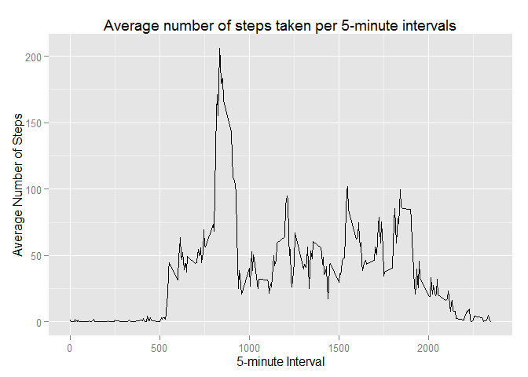

# Reproducible Research: Peer Assessment 1

This assignment makes use of data from a personal activity monitoring device. This device collects data at 5 minute intervals throughout the day. The data consists of two months of data from an anonymous individual collected during the months of October and November, 2012 and include the number of steps taken in 5 minute intervals each day.

The variables included in this dataset are:
(a) steps: Number of steps taking in a 5-minute interval (missing values are coded as NA).
(b) date: The date on which the measurement was taken in YYYY-MM-DD format.
(c) interval: Identifier for the 5-minute interval in which measurement was taken.


### Loading and preprocessing the data

```r
data<-read.csv("activity.csv")
library(ggplot2)
```

```
## Warning: package 'ggplot2' was built under R version 3.2.1
```

### Mean total number of steps taken per day

```r
## For this part of the assignment, the missing values in the dataset are ignored

## 1.Calculate the total number of steps taken per day
subset1<-data.frame(data[,1:2])
totalsteps<-aggregate(.~date, data=subset1, sum)

## 2.Make a histogram of the total number of steps taken each day

## Characteristics of a Histogram: (1) shows distributions of variables (continuous data), (2) plots binned quantitative data (consecutive, non-overlapping intervals of a variable), (3) Bars cannot be reordered
## Sources: https://en.wikipedia.org/wiki/Histogram, http://www.forbes.com/sites/naomirobbins/2012/01/04/a-histogram-is-not-a-bar-chart/

totalsteps$day<-as.POSIXlt(totalsteps$date)
totalsteps$day<-format(totalsteps$day, "%m-%d")

g <- ggplot(totalsteps, aes(day, steps))
g + geom_bar(stat="identity") +
    ggtitle("Total number of steps taken each day (NAs ignored)") +
    labs(x="Day (Year = 2012)", y="Total Number of Steps", size = 10) +
    scale_x_discrete(breaks=c("10-02","10-10","10-20","10-30","11-11","11-20","11-29"), 
    labels=c("10-02","10-10","10-20","10-30","11-11","11-20","11-29"))
```

 

```r
## 3.Calculate and report the mean and median of the total number of steps taken per day
mean(totalsteps$steps, na.rm=T) ## Answer: 10,766.19
```

```
## [1] 10766.19
```

```r
median(totalsteps$steps, na.rm=T) ## Answer: 10,765
```

```
## [1] 10765
```

### Average daily activity pattern

```r
## 1. Make a time series plot (i.e. type = "l") of the 5-minute interval (x-axis) and the average number of steps taken, averaged across all days (y-axis)
avgsteps<-aggregate(.~interval, data=data, mean)

g4 <- ggplot(avgsteps, aes(interval, steps))
g4 + geom_line() + 
    ggtitle("Average number of steps taken per 5-minute intervals") +
    labs(x="5-minute Interval", y="Average Number of Steps", size = 10)
```

 

```r
## 2. Which 5-minute interval, on average across all the days in the dataset, contains the maximum number of steps?
maxstep<-which(avgsteps$steps == max(avgsteps$steps))  ## Max step is 206.1698
avgsteps$interval[maxstep]  ## Answer: 835
```

```
## [1] 835
```

### Inputing missing values

```r
## 1.Calculate and report the total number of missing values in the dataset (i.e. the total number of rows with NAs)
nasteps<-which(is.na(data$steps))
length(nasteps) ## Out of 17,568 rows of data, 2,304 NA rows account for 13.1% of the total 
```

```
## [1] 2304
```

##### 2. Devise a strategy for filling in all of the missing values in the dataset. The strategy does not need to be sophisticated. For example, you could use the mean/median for that day, or the mean for that 5-minute interval, etc.

* To fill in the missing values in the dataset, the strategy is to use the mean for each respective 5-minute interval


```r
## 3. Create a new dataset that is equal to the original dataset but with the missing data filled in.
data2<-data
for (i in 1:length(nasteps)) {
    narow <- which(data2[nasteps[i],3] == avgsteps$interval)
    data2[nasteps[i],1] <- avgsteps[narow, 2]
}

## 4. Make a histogram of the total number of steps taken each day and calculate and report the mean and median total number of steps taken per day. 
subset2<-data.frame(data2[,1:2])
totalsteps2<-aggregate(.~date, data=subset2, sum)

totalsteps2$day<-as.POSIXlt(totalsteps2$date)
totalsteps2$day<-format(totalsteps2$day, "%m-%d")

g2 <- ggplot(totalsteps2, aes(day, steps))
g2 + geom_bar(stat="identity") +
    ggtitle("Total number of steps taken each day (NAs filled-in)") +
    labs(x="Day (Year = 2012)", y="Total Number of Steps", size = 10) +
    scale_x_discrete(breaks=c("10-02","10-10","10-20","10-30","11-11","11-20","11-29"), 
    labels=c("10-02","10-10","10-20","10-30","11-11","11-20","11-29"))
```

 

```r
mean(totalsteps2$steps) ## Answer: 10,766.19
```

```
## [1] 10766.19
```

```r
median(totalsteps2$steps) ## Answer: 10,766.19
```

```
## [1] 10766.19
```

##### Do these values differ from the estimates from the first part of the assignment? 
* Both histograms are similar with few differences. A few days/intervals values went up significantly while others went down somewhat. The reason may be that NA values account for only 13% of the total data but they are concentrated on a few days/intervals rather than across all days.
* Mean and median values for both sets of data have not changed much. They both remain very near 10,766. 

##### What is the impact of inputing missing data on the estimates of the total daily number of steps?
* Replacing NAs with the mean values of their respective 5-minute intervals does not seem to impact significantly on the results of both histograms, means and medians.
* If other types of calculations or summaries of the data were made (ie. instead of replacing NAs with means or medians), it's possible that significant biases could be seen because of the NAs.


### Differences in activity patterns between weekdays and weekends

```r
## The dataset with the filled-in missing values is used for this part.

## 1.Create a new factor variable in the dataset with two levels - "weekday" and "weekend" indicating whether a given date is a weekday or weekend day.
data3<-data2
data3$weekday <- weekdays(as.Date(data3$date))
wkday<-data.frame(weekday=c("Monday","Tuesday","Wednesday","Thursday","Friday"))
wkend<-data.frame(weekend=c("Saturday","Sunday"))

wkdayrows<-which(data3$weekday %in% wkday$weekday) ## 12,960 rows
wkendrows<-which(data3$weekday %in% wkend$weekend) ## 4608 rows
data3$type<-factor(c("weekday","weekend"))
data3[wkdayrows,5]<-"weekday"
data3[wkendrows,5]<-"weekend"

## 2.Make a panel plot containing a time series plot (i.e. type = "l") of the 5-minute interval (x-axis) and the average number of steps taken, averaged across all weekday days or weekend days (y-axis). 
subset3<-data.frame(data3$interval, data3$type, data3$steps)
avgsteps3<-aggregate(.~data3.interval + data3.type, data=subset3, mean)

g3 <- ggplot(avgsteps3, aes(data3.interval, data3.steps))
g3 + geom_line() + 
    facet_grid(data3.type ~ .) +
    ggtitle("Average number of steps taken per 5-minute intervals") +
    labs(x="5-minute Interval", y="Average Number of Steps", size = 10)
```

 
